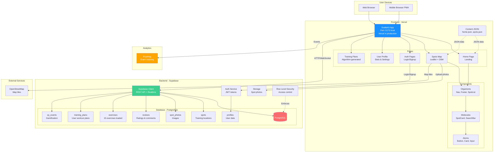
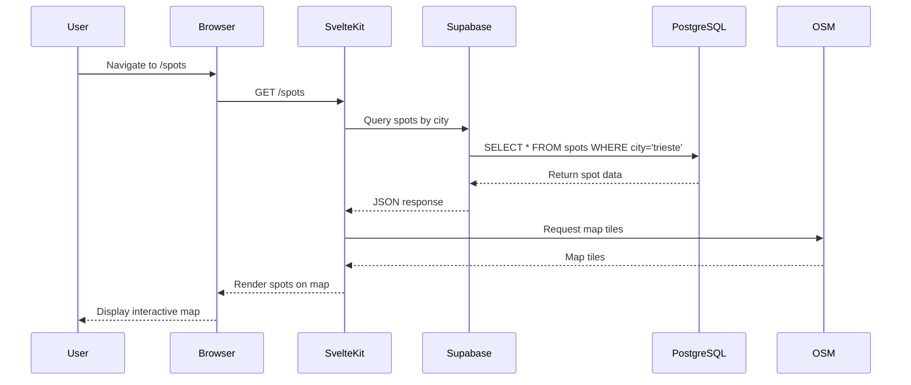
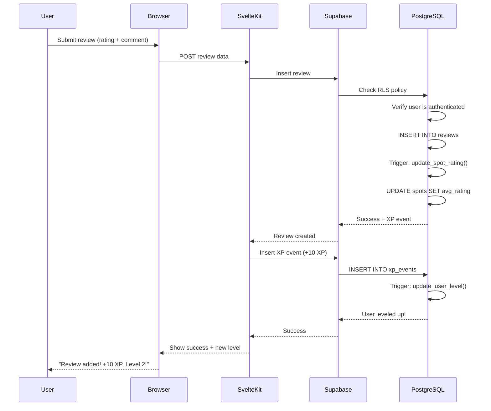
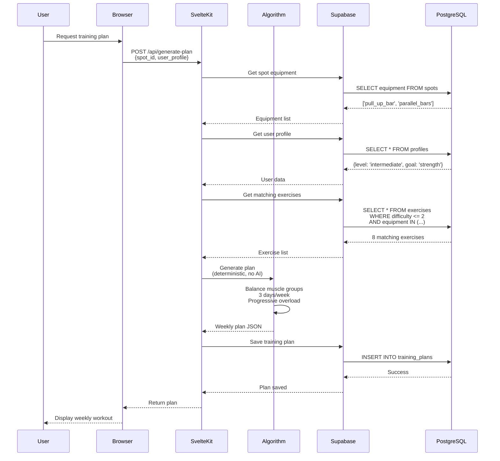
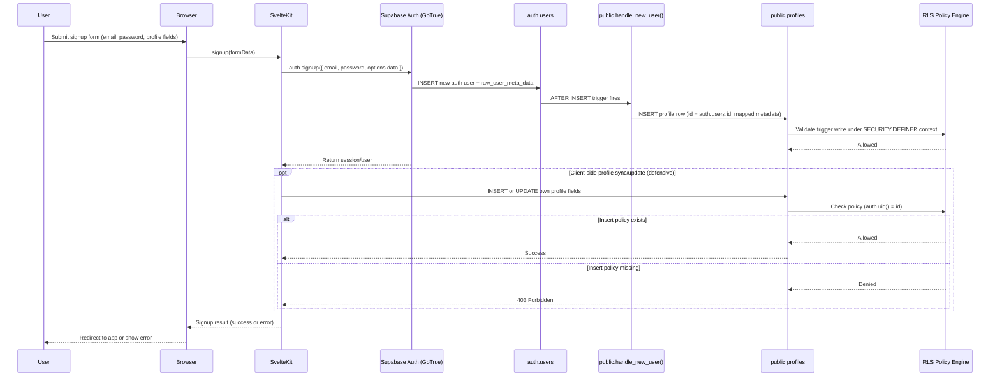
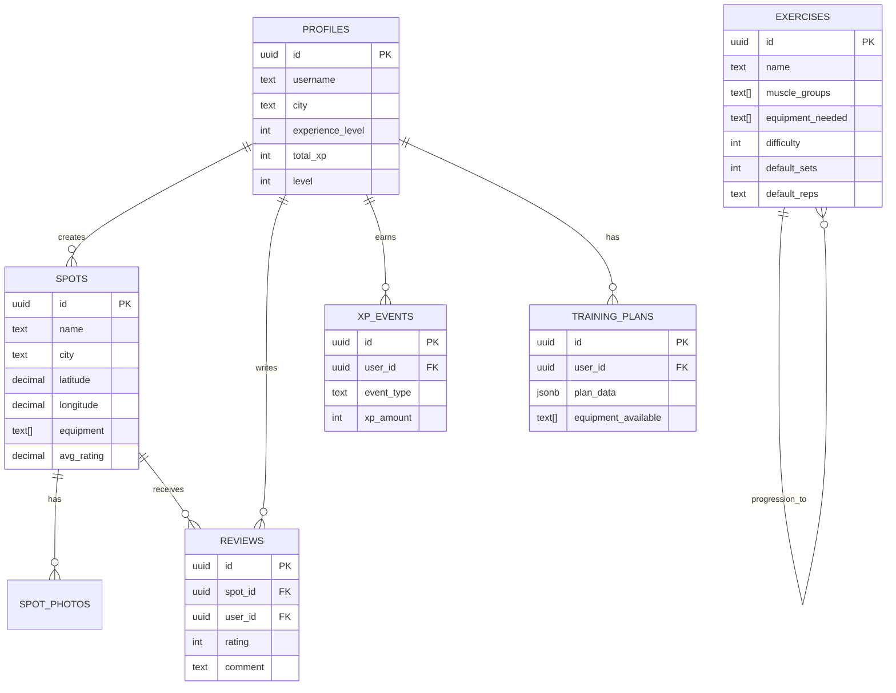
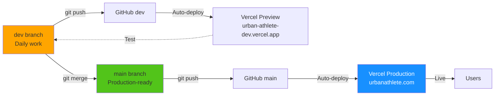

# System Architecture & Data Flow

**Version:** 0.1  
**Last Updated:** 2025-06-25  
**Status:** Sprint 0 Complete

---

## System Overview

The Urban Athlete Platform is a three-tier web application with frontend (SvelteKit), backend (Supabase), and database (PostgreSQL).

---

## Architecture Diagram



---

## Data Flow Examples

### 1. User Views Training Spots



### 2. User Adds a Review



### 3. Generate Training Plan (Algorithm)



### 4. Registration & Profile Creation Flow



Expected behavior:
- `auth.users` is the source of identity, and `public.profiles` stores app-specific user fields.
- `public.handle_new_user()` should auto-create the profile row immediately after signup.
- Client-side profile insert/update must pass RLS (`auth.uid() = id`) and needs explicit `INSERT` policy for inserts.
- If `INSERT` policy is missing, profile writes return `403 Forbidden` even for authenticated users.

---

## Technology Stack

| Layer | Technology | Purpose |
|---|---|---|
| **Frontend** | SvelteKit 2 | Web framework (SSR + SPA) |
| | Tailwind CSS 3 | Styling (utility-first) |
| | Leaflet | Interactive maps |
| | Lucide Icons | Icon library |
| **Backend** | Supabase | All-in-one backend |
| | PostgreSQL | Database |
| | PostgREST | Auto-generated REST API |
| | GoTrue | Authentication (JWT) |
| | Realtime | WebSocket subscriptions |
| **Storage** | Supabase Storage | Image hosting (spot photos) |
| **Analytics** | PostHog | Event tracking, funnels |
| **Hosting** | Vercel | Frontend deployment |
| | Supabase Cloud | Backend + DB hosting |
| **Domain** | Hostinger | Domain name + email |

---

## Database Schema (Summary)



---

## Security Model

### Row Level Security (RLS)

All tables have RLS enabled with specific policies:

| Table | Read | Write |
|---|---|---|
| **profiles** | Everyone | Own profile only |
| **spots** | Everyone | Authenticated users |
| **reviews** | Everyone | Own reviews only |
| **exercises** | Everyone | Admin only (read-only for users) |
| **training_plans** | Own plans only | Own plans only |
| **xp_events** | Own events only | System only |

### Authentication Flow

1. User signs up → Supabase creates `auth.users` entry
2. Trigger creates `profiles` entry with same UUID
3. JWT token issued (expires in 1 hour)
4. Token included in all API requests
5. RLS policies enforce access control

---

## Deployment Pipeline



---

## Current Status (Sprint 0 Complete)

### ✅ Completed
- [x] Project setup (Git, GitHub, branches)
- [x] SvelteKit app scaffold
- [x] Design system (Tailwind config)
- [x] Atomic component structure
- [x] Content system (JSON-based)
- [x] Home page (landing)
- [x] Supabase project created
- [x] Database schema (all tables)
- [x] Exercise database (15 exercises)
- [x] Git workflow (dev/main branches)
- [x] Documentation complete

### 🔜 Next (Sprint 1)
- [ ] Authentication (login/signup)
- [ ] Navigation component
- [ ] Spots map page (Leaflet)
- [ ] Add spot form
- [ ] Deploy to Vercel

---

## Environment Variables

Required in `.env` (local) and Vercel (production):

```bash
# Supabase
VITE_SUPABASE_URL=https://uidvrhthkeqxwytangnt.supabase.co
VITE_SUPABASE_ANON_KEY=your_anon_key_here

# PostHog (later)
VITE_POSTHOG_KEY=your_key_here
```

---

## Key Files & Locations

| Path | Purpose |
|---|---|
| `app/src/routes/+page.svelte` | Home page |
| `app/src/lib/components/` | Reusable components |
| `app/src/lib/content/` | JSON content files |
| `app/src/lib/utils/supabase.js` | Supabase client |
| `app/supabase/migrations/` | Database schema SQL |
| `app/supabase/seed/` | Exercise data SQL |
| `docs/` | All documentation |
| `.windsurf/workflows/` | Development workflows |

---

## Quick Start (For Next Session)

```bash
# 1. Pull latest code
git checkout dev
git pull origin dev

# 2. Start dev server
cd app
npm run dev

# 3. Open browser
http://localhost:5173

# 4. Continue building Sprint 1 features
```

---

**Last updated:** 2025-06-25 17:05  
**Next milestone:** Deploy to Vercel + Start Sprint 1
